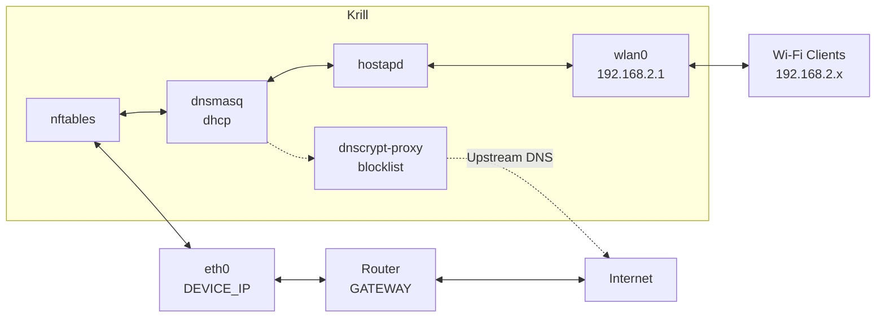

This script turns my old netbook into a basic, secure gateway.

## Hardware

<!--  -->

- **Model:** Asus Eee PC X101CH
- **CPU:** Intel Atom N2600
- **RAM:** 980 MB

## Architecture



## Prerequisites

- Alpine Linux fresh install
- Internet connection via `eth0` (DHCP or static)
- Wi-Fi card capable of AP mode (confirm with `iw list | grep "Supported interface modes" -A5`)

## Design

Krill was built under strict hardware constraints. Every choice balances security with a minimal resource usage.

### OS Selection: Why Alpine?
*   **vs. BSD (pfSense):** BSD lacks mature wireless driver support for commodity laptop Wi-Fi cards.
*   **vs. VyOS:** Too resource-heavy and lacks native tools for consumer Wi-Fi.
*   **vs. OpenWrt:** OpenWrt forces you into its monolithic ecosystem.

Alpine offers a standard and lightweight Linux environment with unabstracted configurations.

### Service Trade-offs
*   **DNS (dnscrypt-proxy vs. Unbound):** Unbound is an excellent recursive DNS but scales up in memory. 
*   **DHCP (dnsmasq vs. Kea DHCP):** Kea is the modern enterprise standard but adds overhead. 

### Why a Bash script?
Automation tools would be overengineering, since they're typically used for multi-node deployments while Krill is a single machine. The same goes for packaging an .iso for a non-reproducible machine.
And for that very reason, the subnet's IP address is hardcoded (192.168.2.1). It isn't designed for a deployment environment with multiple subnets.

## Installation
<!--
[](https://asciinema.org/placeholder)
-->

1. **Download**
   ```
    wget https://github.com/miguelpernudo/netdev-infra/archive/refs/heads/main.tar.gz
   ```
   or
   ```
    curl -L https://github.com/miguelpernudo/netdev-infra/archive/refs/heads/main.tar.gz
   ```

2. **Extract**
   ```
   tar -xzf main.tar.gz
    cd netdev-infra-main
   ```

3. **Configure secrets**
   ```
   cp secrets.env.example secrets.env
   vi secrets.env
   ```
   Set your device's static IP, gateway, and Wi-Fi password.

4. **Install**
   ```
   doas sh install.sh
   ```
   or `sudo sh install.sh`.

   > The script enables the Alpine community repo automatically (dnscrypt-proxy is not in main).

## Files

```
.
├── etc
│   ├── dnscrypt-proxy
│   │   └── dnscrypt-proxy.toml
│   ├── dnsmasq.conf
│   ├── hostapd
│   │   └── hostapd.conf
│   ├── init.d
│   │   └── krill-tc
│   ├── logrotate.d
│   │   └── dnscrypt-proxy
│   ├── network
│   │   └── interfaces
│   ├── nftables.nft
│   └── tc.qos
├── install.sh
├── LICENSE
├── README.md
└── secrets.env.example
```

## Services

**hostapd**: Turns `wlan0` into a Wi-Fi AP (SSID, channel, WPA2). `rc-service hostapd status`

**dnsmasq**: DHCP server for Wi-Fi clients plus DNS forwarding to dnscrypt-proxy. `rc-service dnsmasq status`

**dnscrypt-proxy**: Encrypts DNS queries and blocks ads via blocklist. `rc-service dnscrypt-proxy status`

**nftables** firewall: NAT, SSH (LAN only), DNS/DHCP on wlan0. `nft list ruleset`

**Traffic control**: HTB hierarchy prioritises SSH, DNS, and web traffic, rate-limits bulk. Shaped on both `eth0` (upload) and `wlan0` (download). `rc-service krill-tc status`

> **Roadmap:** eBPF-based metrics exporter.

## Firewall rules

Defined in `etc/nftables.nft`:

- **Default policy:** drop on input and forward
- **SSH:** allowed only from `192.168.0.0/16` (LAN)
- **DNS/DHCP:** allowed from `wlan0` only
- **ICMP:** rate-limited
- **NAT:** masquerade on `eth0` for Wi-Fi clients

## Maintenance

### Blocklist updates

The install script downloads a blocklist from [hagezi's DNS blocklists](https://github.com/hagezi/dns-blocklists). To keep it updated automatically, add a weekly cronjob:

```
doas vi /etc/periodic/weekly/update-blocklist
```

```sh
#!/bin/sh
wget -O /etc/dnscrypt-proxy/blocked-names.txt \
  https://raw.githubusercontent.com/hagezi/dns-blocklists/main/domains/pro.txt
rc-service dnscrypt-proxy restart
```

```
doas chmod +x /etc/periodic/weekly/update-blocklist
```

### Log rotation

Logrotate is configured for dnscrypt-proxy at `/etc/logrotate.d/dnscrypt-proxy`.

## Troubleshooting

```sh
# Check service status
rc-service hostapd status
rc-service dnsmasq status
rc-service dnscrypt-proxy status
rc-service nftables status
rc-service krill-tc status

# Verify Wi-Fi interface
iw dev wlan0 info

# Check assigned IPs
ip addr show

# Inspect firewall rules
nft list ruleset
```
